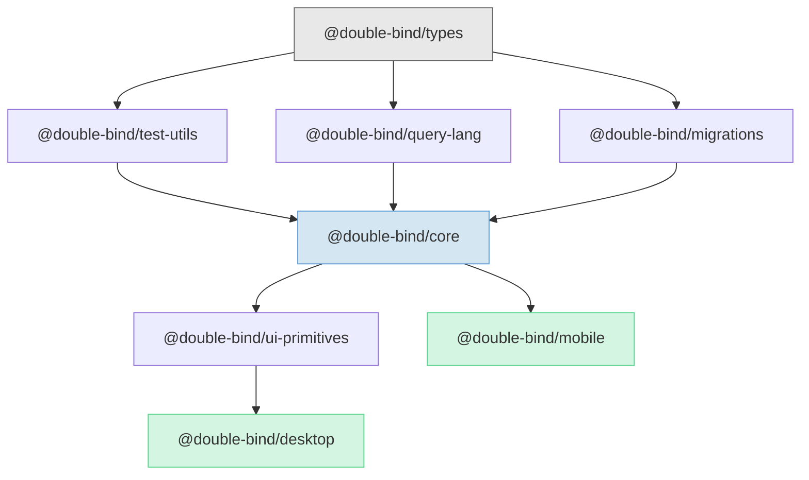

# Double-Bind

[](https://github.com/julianken/double-bind/actions/workflows/ci.yml)
[](LICENSE)
[](https://www.typescriptlang.org/)

Every block is a first-class graph node with a stable ULID. References survive moves across pages. Backlinks, PageRank, and neighborhood traversal are built into the data model -- not plugins. All data stays on the user's machine.

Double-Bind is a local-first, block-based note-taking application with graph-native architecture.

<!-- TODO: Add screenshot of editor + graph view -->
<!--  -->

## Tech Stack

| Layer           | Technology                           |
| --------------- | ------------------------------------ |
| Desktop Shell   | Tauri v2                             |
| Language        | TypeScript 5.7+                      |
| Frontend        | React 19, ProseMirror, Zustand       |
| Database        | SQLite (WAL mode) via rusqlite       |
| Search          | Contentless FTS5                     |
| Block Ordering  | Fractional indexing (lexicographic)  |
| Graph Traversal | Recursive CTEs                       |
| Testing         | Vitest, Playwright                   |
| Package Manager | pnpm 9                               |

## Architecture

All business logic is TypeScript. The Rust layer is a ~40-line IPC shim wrapping rusqlite -- it forwards SQL and returns results. It never changes when the data model changes. This keeps TDD cycle times under 5 seconds and allows code reuse across desktop and mobile clients.

```
React + ProseMirror (editor, graph view, search UI)
        |
Zustand + Query Hooks (state management)
        |
Services (PageService, BlockService, GraphService)
        |
Repositories (parameterized SQL)
        |
Database Interface  <-- DI boundary
        |
========|======== Tauri IPC ========
        |
Rust Shim (~40 lines) --> rusqlite
        |
SQLite (WAL mode)
```

The `Database` interface is the sole dependency injection boundary. Four adapters implement it:

| Client             | Adapter                  | Backing Store                  |
| ------------------ | ------------------------ | ------------------------------ |
| Desktop (prod)     | `TauriDatabaseProvider`  | rusqlite via Tauri IPC         |
| Desktop (dev)      | `HttpDatabaseProvider`   | better-sqlite3 via HTTP bridge |
| Integration tests  | `SqliteNodeAdapter`      | better-sqlite3 directly        |
| Mobile             | `MobileDatabaseProvider` | op-sqlite                      |

15 Architecture Decision Records in [`docs/decisions/`](docs/decisions/).

## Monorepo Structure

10 packages with strict layered dependencies. Higher layers import from lower layers, never the reverse.



```
L0  types                          (zero dependencies)
L1  test-utils, query-lang, migrations
L2  core                           (business logic, repositories, services)
L3  ui-primitives                  (React components, ProseMirror editor)
L4  desktop, mobile                (platform shells)
```

## Test Strategy

Four layers, from fast to comprehensive:

| Layer       | Tool                      | What It Tests                          |
| ----------- | ------------------------- | -------------------------------------- |
| Unit        | Vitest + MockDatabase     | Business logic in isolation            |
| Integration | Vitest + better-sqlite3   | SQL queries against real SQLite        |
| E2E Fast    | Playwright + Vite         | UI flows with mock Tauri IPC           |
| E2E Full    | Playwright + Tauri binary | Complete application stack             |

All tests are deterministic -- no shared fixtures, no timing dependencies. Each test creates its own state.

## Quick Start

Prerequisites: Node.js >= 20, pnpm 9, Rust toolchain (for Tauri).

```bash
pnpm install              # Install dependencies
pnpm dev:desktop          # Full Tauri app with hot reload
pnpm test                 # Run all unit tests
pnpm test:integration     # Integration tests (real SQLite)
pnpm test:e2e             # E2E with mock Tauri IPC
pnpm build:desktop        # Build Tauri binary
pnpm lint                 # Lint all packages
pnpm typecheck            # Type check all packages
```

## Documentation

| Area           | Path                                           |
| -------------- | ---------------------------------------------- |
| Architecture   | [`docs/architecture/`](docs/architecture/)     |
| ADRs           | [`docs/decisions/`](docs/decisions/)           |
| Database       | [`docs/database/`](docs/database/)             |
| Frontend       | [`docs/frontend/`](docs/frontend/)             |
| Testing        | [`docs/testing/`](docs/testing/)               |
| Methodology    | [`docs/methodology/`](docs/methodology/)       |
| Security       | [`docs/security/`](docs/security/)             |
| Packages       | [`docs/packages/`](docs/packages/)             |
| Infrastructure | [`docs/infrastructure/`](docs/infrastructure/) |
| Research       | [`docs/research/`](docs/research/)             |

## Development Methodology

This project is developed using multi-agent AI orchestration. The developer designs architecture, makes decisions, and reviews all output. AI agents handle implementation through a formal pipeline.

Each task follows an implementer, spec reviewer, quality reviewer sequence. Pre-commit hooks ([`.claude/hooks/`](.claude/hooks/)) enforce quality gates -- blocking debug artifacts, detecting console.log in staged diffs, and running incremental type checks.

The full agent orchestration specs live in [`.claude/skills/`](.claude/skills/). See [`docs/methodology/`](docs/methodology/) for an overview.

## License

MIT -- see [LICENSE](LICENSE).
