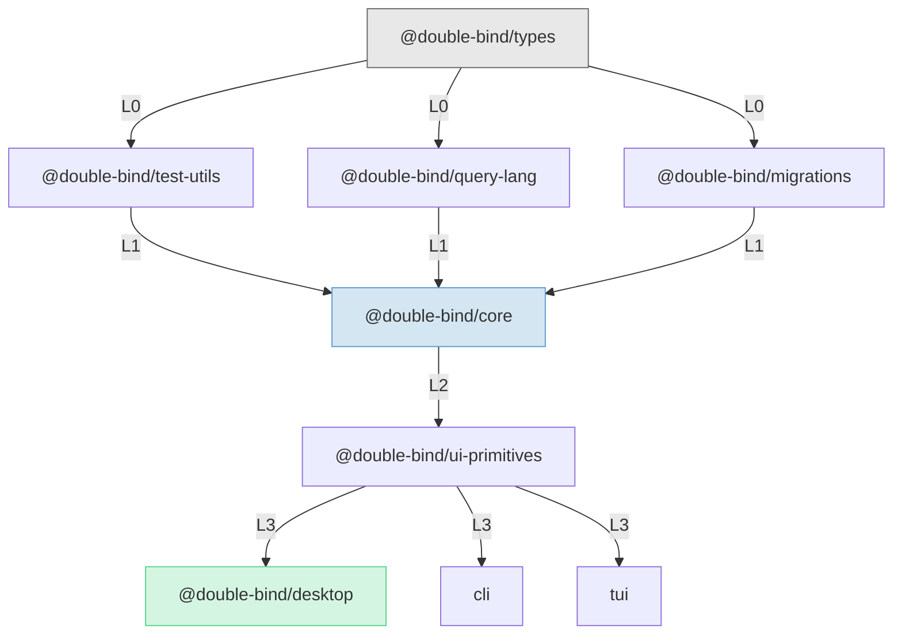

# Double-Bind

A local-first, graph-native note-taking application. Every block is a first-class node with a unique ID; references survive moves across pages. Graph operations (backlinks, neighborhood traversal, PageRank) are built into the data model, not bolted on as an afterthought. All data stays on the user's machine -- no cloud dependency.

## Tech Stack

| Layer           | Technology                           |
| --------------- | ------------------------------------ |
| Desktop Shell   | Tauri v2                             |
| Language        | TypeScript 5.7+                      |
| Frontend        | React 19, ProseMirror, Zustand       |
| Database        | SQLite (WAL mode) via rusqlite       |
| Search          | Contentless FTS5                     |
| Block Ordering  | Fractional indexing (lexicographic)  |
| Graph Traversal | Recursive CTEs                       |
| Testing         | Vitest, Playwright                   |
| Package Manager | pnpm 9.15                            |

## Architecture

All business logic is TypeScript. The Rust layer is a ~40-line IPC shim wrapping rusqlite -- it forwards SQL and returns results. It never changes when the data model changes. This keeps TDD cycle times under 5 seconds and allows >80% code reuse across desktop, CLI, and TUI clients.

```
React + ProseMirror (editor, graph view, search UI)
        |
Zustand + Query Hooks (state management)
        |
Services (PageService, BlockService, GraphService)
        |
Repositories (parameterized SQL)
        |
Database Interface  <-- DI boundary
        |
========|======== Tauri IPC ========
        |
Rust Shim (~40 lines) --> rusqlite
        |
SQLite (WAL mode)
```

The `Database` interface is the sole dependency injection boundary. Four adapters implement it:

| Client             | Adapter                | Backing Store                  |
| ------------------ | ---------------------- | ------------------------------ |
| Desktop (prod)     | `TauriDatabaseProvider`| rusqlite via Tauri IPC         |
| Desktop (dev)      | `HttpDatabaseProvider` | better-sqlite3 via HTTP bridge |
| Integration tests  | `SqliteNodeAdapter`    | better-sqlite3 directly        |
| Mobile             | `MobileDatabaseProvider`| op-sqlite                     |

### Design Decisions

- **Contentless FTS5** for full-text search with minimal storage overhead
- **String-based fractional indexing** (a la Figma) for block ordering -- O(1) inserts, no rebalancing ever
- **Recursive CTEs** for graph traversal instead of application-level BFS
- **ULID block identifiers** -- lexicographically sortable, globally unique, no coordination required
- **Minimal Rust shim** -- forwards SQL to rusqlite and returns JSON results; all query construction and validation happens in the TypeScript repository layer

15 Architecture Decision Records in [`docs/decisions/`](docs/decisions/).

## Monorepo Structure

10 packages with strict layered dependencies. Higher layers import from lower layers, never the reverse.



```
L0  types                          (zero dependencies)
L1  test-utils, query-lang, migrations
L2  core                           (business logic, repositories, services)
L3  ui-primitives                  (React components, ProseMirror editor)
L4  desktop, cli, tui              (platform shells)
```

## Test Strategy

Four layers, from fast to comprehensive:

| Layer       | Tool                      | What It Tests                          |
| ----------- | ------------------------- | -------------------------------------- |
| Unit        | Vitest + MockDatabase     | Business logic in isolation            |
| Integration | Vitest + better-sqlite3   | SQL queries against real SQLite        |
| E2E Fast    | Playwright + Vite         | UI flows with mock Tauri IPC           |
| E2E Full    | Playwright + Tauri binary | Complete application stack             |

Unit and integration tests run on every change. E2E fast runs before PRs. E2E full runs for IPC and Rust shim changes. All tests are deterministic -- no shared fixtures, no timing dependencies. Each test creates its own state.

## Quick Start

Prerequisites: Node.js >= 20, pnpm 9.15, Rust toolchain (for Tauri).

```bash
pnpm install              # Install dependencies
pnpm dev:desktop          # Full Tauri app with hot reload
pnpm test                 # Run all unit tests
pnpm test:integration     # Integration tests (real SQLite)
pnpm test:e2e             # E2E with mock Tauri IPC
pnpm build:desktop        # Build Tauri binary
pnpm lint                 # Lint all packages
pnpm typecheck            # Type check all packages
```

## Development Methodology

This project is developed using a multi-agent AI development methodology. The architecture, test strategy, and quality gates were designed by the developer. Implementation is executed through orchestrated AI agents.

**Workflow pipeline:** Each task follows an implementer, spec reviewer, quality reviewer sequence. The implementer writes code; the spec reviewer validates against requirements; the quality reviewer checks for regressions, test coverage, and adherence to architectural constraints.

**Quality gates:** Pre-commit hooks ([`.claude/hooks/`](.claude/hooks/)) enforce automated checks -- blocking debug artifacts, console.log statements, and running type checks on affected packages.

**Methodology specs:** The full agent orchestration configuration lives in [`.claude/skills/`](.claude/skills/), including the subagent workflow, analysis funnels, and decision funnels.

## Documentation

| Area           | Path                                           |
| -------------- | ---------------------------------------------- |
| Architecture   | [`docs/architecture/`](docs/architecture/)     |
| ADRs           | [`docs/decisions/`](docs/decisions/)           |
| Database       | [`docs/database/`](docs/database/)             |
| Frontend       | [`docs/frontend/`](docs/frontend/)             |
| Testing        | [`docs/testing/`](docs/testing/)               |
| Security       | [`docs/security/`](docs/security/)             |
| Packages       | [`docs/packages/`](docs/packages/)             |
| Infrastructure | [`docs/infrastructure/`](docs/infrastructure/) |
| Research       | [`docs/research/`](docs/research/)             |

## License

MIT -- see [LICENSE](LICENSE).
